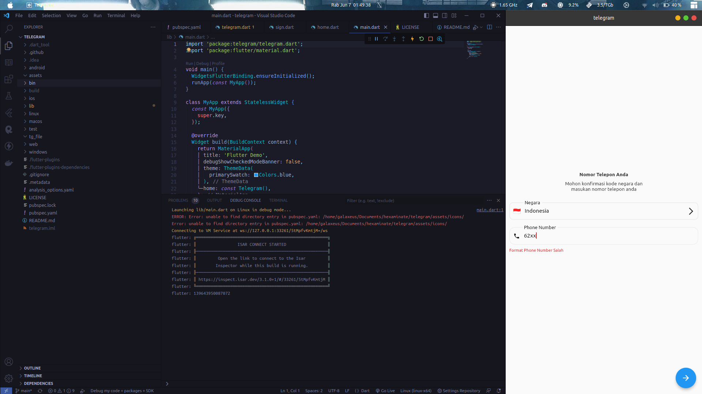
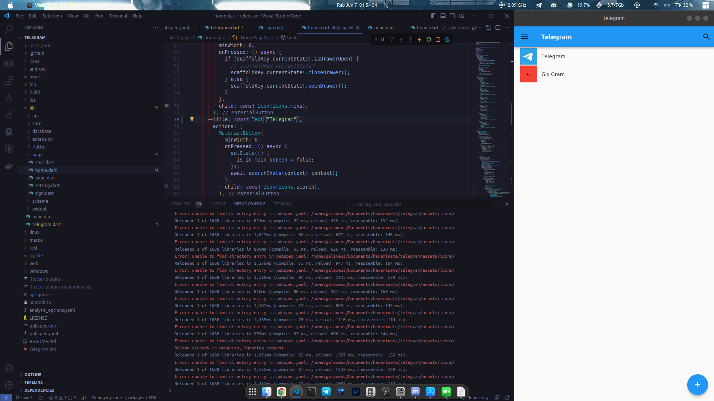

# Wip Telegram Full Open Source

Wip Telegram Open Source

---

### Building / Compile Project

1. Local PC

```bash
git clone https://github.com/azkadev/telegram.git
cd telegram
flutter build
```

### Docs Source Learning Development This Project

1. [TDLIB - DOCS](https://core.telegram.org/tdlib/docs)
2. [Flutter](https://docs.flutter.dev/)
3. [Dart](https://dart.dev/guides)

### Screenshot Development



